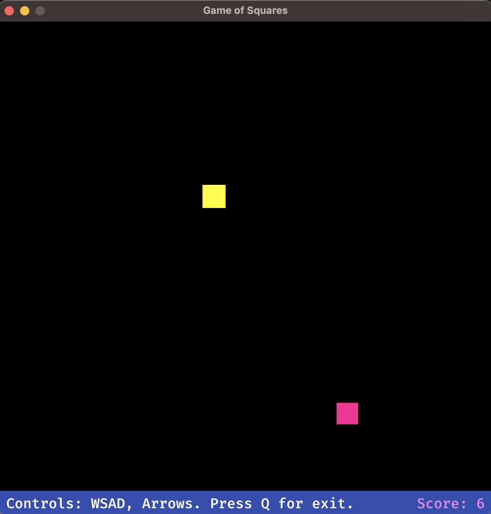

# Game of Squares: A Simple 2D Demo



## Overview
It is a 2D demo project built using the Rust programming language. It serves as a playful exploration of graphics and game development, showcasing the potential of Rust in creating lightweight and high-performance applications.

## Features
- 🖼️ **2D Graphics**: Leveraging the Bevy game engine to render 2D graphics, bringing the _vibrant_ world of squares to life.
- 🎮 **Gamepad Support**: Integrated gamepad support ensures a seamless gaming experience. Just use the left stick to move!
- 💥 **Collision Detection**: Incorporates basic collision detection mechanics.
- 😜 **Simple Logic**: _Easy-to-understand game logic, making it accessible to players of all ages._

## Build with
- 🦀 **Rust**: Utilizing the latest edition of Rust, ensuring modern, reliable, and efficient code.
- 👾 **Bevy Game Engine**: A popular Rust game engine that aids in building high-performance and data-driven game applications.
- 🎲 **rand crate**: For random number generation.

## Getting Started
To get started with the development, ensure you have Rust installed. Clone the repository and navigate to the project directory:

```sh
git clone https://github.com/yourusername/game_of_squares.git
cd game_of_squares
```

Run the game using the following command:

```sh
cargo run
```

